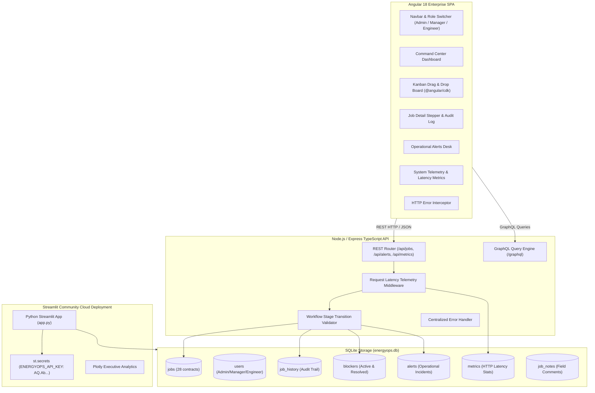
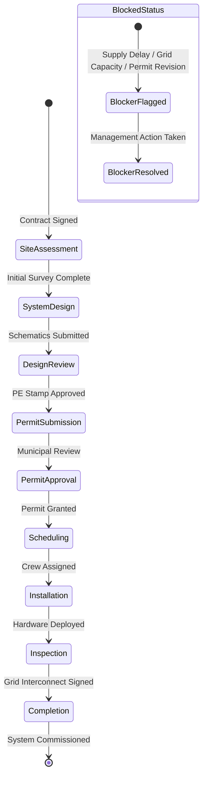

# ⚡ EnergyOps – Installation Workflow & Operations Platform

[](https://energyops-workflow-platform-mcwfe3b7hcmhuf7ykaxetd.streamlit.app/)
[](https://angular.io)
[](https://www.typescriptlang.org/)
[](https://nodejs.org)
[](https://www.sqlite.org)
[](https://vitest.dev)

> **Enterprise Energy Installation Workflow, Operational Telemetry, and Incidents Management Platform**  
> 🔗 **Live Cloud App**: [https://energyops-workflow-platform-mcwfe3b7hcmhuf7ykaxetd.streamlit.app/](https://energyops-workflow-platform-mcwfe3b7hcmhuf7ykaxetd.streamlit.app/)  
> 📂 **GitHub Repository**: [https://github.com/Dhanya562004/energyops-workflow-platform.git](https://github.com/Dhanya562004/energyops-workflow-platform.git)

---

## 📌 Executive Summary & Problem Statement

Clean energy installation companies (solar, microgrid systems, industrial battery storage, EV charging hubs, and wind turbines) face severe operational friction across job lifecycles. Standard CRUD dashboards fail to handle real-world operational challenges:

1. **Strict Stage Transition Guards**: Moving a contract forward without completed design reviews or approved municipal permits leads to costly site re-work and compliance fines.
2. **Operational Blocker Escalation**: Supply-chain delays, utility interconnect rejections, and structural roof reinforcements require automatic alert triggers (>24h blocked) and incident resolution workflows.
3. **Multi-Role Governance**: Admins, Operational Managers, and Field Lead Engineers require role-scoped actions (e.g. stage sequence overrides vs field progress logging).
4. **Real-Time Observability & Telemetry**: Tracking labor-hour budget variances, permit overdue risks, and API endpoint latencies.

**EnergyOps** addresses these enterprise challenges as a full-stack engineering platform combining an **Angular 18 SPA**, a **Node.js/Express TypeScript REST & GraphQL API server**, a **relational SQLite database**, and a **Python Streamlit Executive Dashboard** deployed on Streamlit Cloud with secure Streamlit Secrets (`st.secrets["ENERGYOPS_API_KEY"]`).

---

## 🚀 Live Cloud Deployment & Links

| Service | Technology | Status / Link |
| :--- | :--- | :--- |
| **Streamlit Production App** | Streamlit + Python 3.13 + Plotly | [🌐 Launch Live App](https://energyops-workflow-platform-mcwfe3b7hcmhuf7ykaxetd.streamlit.app/) |
| **Angular 18 Client** | Angular 18 + SCSS + RxJS | `http://localhost:4200` (Local) |
| **Node.js REST API** | Express + TypeScript + SQLite | `http://localhost:3000/api` (Local) |
| **GraphQL Bonus Layer** | GraphQL Engine | `http://localhost:3000/graphql` (Local) |

---

## 🏗️ System Architecture & Data Flow



---

## 🔄 9 Lifecycle Stages & Workflow Rules



### 9 Sequential Workflow Stages
1. **Site Assessment** ➔ 2. **System Design** ➔ 3. **Design Review** ➔ 4. **Permit Submission** ➔ 5. **Permit Approval** ➔ 6. **Scheduling** ➔ 7. **Installation** ➔ 8. **Inspection** ➔ 9. **Completion**

### Workflow Validation Rules
- **Sequential Enforcer**: Non-admin users must advance stages sequentially (e.g. Stage 2 ➔ Stage 3). Skipping stages without Admin authorization is rejected (400 Bad Request).
- **Blocker Status Lockout**: If a job status is set to `Blocked`, stage advancement is locked until active blockers are resolved.
- **Admin Override**: Admin role can override workflow sequence with audit history recording.

---

## 👥 Role-Based Access Control (Simulated RBAC)

The platform features simulated role switching:
- 🔴 **Admin**: Full stage sequence override, database re-seeding, configuration management.
- 🔵 **Manager**: Stage approvals, assigning lead engineers, resolving active blockers, target date adjustments.
- 🟢 **Engineer**: Updating installation progress %, logging actual labor hours, flagging blockers, posting field notes.

---

## 🛠️ Technology Stack Breakdown

### 🎨 Frontend & Executive Apps
- **Angular 18+**: Standalone Components, Signals / RxJS Streams, Reactive Forms.
- **Streamlit (Python 3.13)**: Executive Command Center, Plotly visualization engine, Streamlit Secrets integration.
- **Styling**: SCSS Design System with CSS Custom Variables, Dark & Light Mode toggle.
- **Drag & Drop**: `@angular/cdk/drag-drop` (Kanban Board Interaction).

### ⚙️ Backend & Storage
- **Node.js v22+ & Express.js**: TypeScript server architecture (`ts-node`).
- **SQLite (`better-sqlite3`)**: Relational database engine with foreign key enforcement and indexes.
- **APIs**: REST API + Bonus GraphQL Query Endpoint (`/graphql`).
- **Testing**: Vitest + Supertest (11 passing tests).

---

## 🛰️ REST API Documentation

| Method | Endpoint | Description |
| :--- | :--- | :--- |
| `GET` | `/api/jobs` | Search, filter (status, stage, engineer, priority), sort, and paginate jobs. |
| `GET` | `/api/jobs/:id` | Fetch job details with complete history audit trail, blockers, and notes. |
| `POST` | `/api/jobs` | Initialize a new installation job contract. |
| `PUT` | `/api/jobs/:id` | Full update of job specifications and labor estimates. |
| `PATCH` | `/api/jobs/:id/stage` | Transition workflow stage with validation check & audit trail. |
| `PATCH` | `/api/jobs/:id/status` | Update status (flags blocker if status is `Blocked`). |
| `POST` | `/api/jobs/:id/blockers` | Flag an operational blocker and lock job status. |
| `PATCH` | `/api/blockers/:id/resolve` | Resolve an active blocker and automatically resume job. |
| `GET` | `/api/alerts` | Retrieve active operational alerts and incidents summary. |
| `PATCH` | `/api/alerts/:id/acknowledge` | Mark an alert as acknowledged. |
| `GET` | `/api/metrics` | Returns live system metrics, latency percentiles, and error counts. |
| `POST` | `/graphql` | Execute GraphQL queries. |

---

## ⚛️ GraphQL Endpoint Examples (`POST /graphql`)

```graphql
query GetHighPrioritySolarJobs {
  jobs(status: "In Progress", priority: "High") {
    id
    customerName
    currentStage
    assignedEngineer
    installationProgress
    targetCompletionDate
    blockers {
      reason
      status
    }
  }
  metrics {
    totalRequests
    successRate
    avgLatencyMs
    version
  }
}
```

---

## 🔐 Streamlit Secrets Configuration Guide

To deploy this platform on **Streamlit Community Cloud** with secure secrets:

1. Go to [share.streamlit.io](https://share.streamlit.io) and connect your repository `Dhanya562004/energyops-workflow-platform`.
2. Go to **App Settings** -> **Secrets**.
3. Add your configuration starting with your `AQ.Ab...` format API key:

```toml
ENERGYOPS_API_KEY = "AQ.Ab1234567890abcdefghijklmnopqrstuvwxyz"
BACKEND_URL = "http://localhost:3000/api"
ENVIRONMENT = "production"
ADMIN_PASSWORD = "energyops_admin_pass"
```

4. Click **Save**. The Streamlit app detects `st.secrets["ENERGYOPS_API_KEY"]` automatically!

---

## 🧪 Testing Suite (11 Passing Tests)

```bash
cd backend
npm test
```

### Verified Test Cases:
1. `GET /api/jobs` pagination metadata verification.
2. Filter jobs by status (`In Progress`).
3. Retrieve single job with relations (history, blockers, alerts).
4. Create new job with default stage assignment.
5. Valid sequential stage transition execution.
6. Rejection of invalid stage skipping (400 Bad Request).
7. Flagging job blocker and verifying automatic status lock.
8. Resolving blocker and verifying automatic job resume.
9. Fetching active operational alerts.
10. Fetching system performance metrics.
11. GraphQL query resolution.

---

## 📊 How This Project Maps to a Real Internal Operations Platform

In clean energy companies (e.g., Tesla Energy, Sunrun, NextEra Energy, ChargePoint):
1. **Stage Gates prevent costly site errors**: Field crews cannot order high-voltage equipment until site assessment and engineering permit approval are completed in software.
2. **Audit Trails ensure compliance**: Municipal agencies require documented histories of who approved electrical schematics and when structural building permits were granted.
3. **Telemetry & Observability protect SLAs**: System performance dashboards notify site reliability engineers if backend endpoints slow down or if job target completion dates fall behind schedule.

---

## 🚀 Local Quickstart & Setup Guide

### 1. Backend Setup
```bash
cd backend
npm install
npm run seed      # Seeds 28 realistic energy installation contracts
npm start         # Express API runs on http://localhost:3000
```

### 2. Angular Frontend Setup
```bash
cd frontend
npm install
npm start         # Angular CLI dev server runs on http://localhost:4200
```

### 3. Streamlit Local Setup
```bash
streamlit run app.py
```

---

## 📄 License
MIT © Deeksha / EnergyOps Platform Engineering
