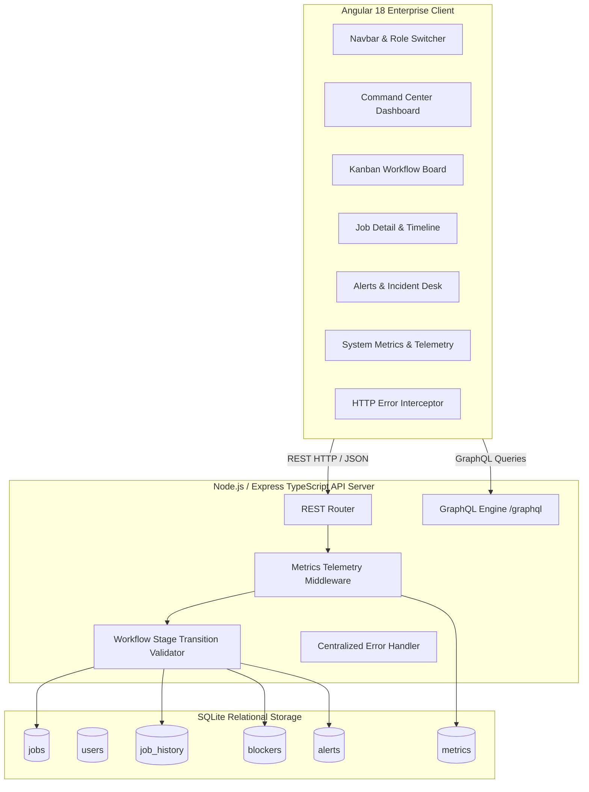

# ⚡ EnergyOps – Installation Workflow & Operations Platform

> **Production-Grade Enterprise Internal Operations & Energy Installation Workflow Management Platform**  
> Built with **Angular 18+ (TypeScript)**, **Node.js / Express**, **SQLite**, **Prisma-style SQL Query Layer**, **REST & GraphQL APIs**, and **Live Observability Telemetry**.

---

## 📌 Executive Summary & Problem Statement

Modern clean-energy operations companies (solar, microgrid, grid-scale battery storage, wind turbines, EV charging hubs) face significant operational friction across job lifecycles. Standard CRUD dashboards fail to model real-world operational constraints such as:
1. **Strict Workflow State Progression**: Skipping design reviews or proceeding without approved permits leads to costly site re-work and regulatory fines.
2. **Operational Blocker Tracking**: When supply-chain delays or utility interconnect issues stall a site, clear escalation paths and alert triggers (>24h blocked) are vital.
3. **Multi-Role Governance**: Admins, Operational Managers, and Field Engineers require role-scoped actions (e.g., stage override vs field progress logging).
4. **Real-Time Telemetry & SLA Visibility**: Monitoring labor-hour variance, permit overdue risks, and API server health.

**EnergyOps** was built to solve these enterprise challenges as a production-style, recruiter-ready internal engineering tool.

---

## 🏗️ System Architecture & Data Flow



---

## 🛠️ Technology Stack

### Frontend (Client-Side)
- **Framework**: Angular 18+ (Standalone Components, Signals / RxJS Streams)
- **Language**: TypeScript 5.5
- **Routing**: Angular Router (Lazy-Loaded Feature Modules)
- **Forms**: Angular Reactive Forms with Custom Validators
- **State & Async**: RxJS BehaviorSubjects & Observables
- **UI & Styling**: Vanilla SCSS Design System with CSS Custom Tokens (Dark & Light Theme Toggle)
- **Drag and Drop**: `@angular/cdk/drag-drop` (Kanban Board Interaction)

### Backend (Server-Side)
- **Runtime**: Node.js v22+
- **Framework**: Express.js with TypeScript (`ts-node`)
- **Database**: SQLite (via `better-sqlite3` native engine with Foreign Key Enforcement & Indexing)
- **APIs**: REST API (Primary) + GraphQL Bonus Endpoint (`/graphql`)
- **Testing**: Vitest + Supertest (Integration & Unit Tests)
- **Middleware**: Custom HTTP Latency Telemetry & Centralized Error Handler

---

## 🔄 Core Business Domain & Workflow Rules

### Installation Job Data Model
Each installation job consists of 17 structured attributes:
`id`, `customerName`, `siteAddress`, `productType`, `assignedEngineer`, `assignedManager`, `currentStage`, `status`, `priority`, `createdAt`, `updatedAt`, `targetCompletionDate`, `blockerReason`, `permitStatus`, `installationProgress`, `estimatedHours`, `actualHours`.

### 9 Sequential Workflow Lifecycle Stages
1. **Site Assessment** ➔ 2. **System Design** ➔ 3. **Design Review** ➔ 4. **Permit Submission** ➔ 5. **Permit Approval** ➔ 6. **Scheduling** ➔ 7. **Installation** ➔ 8. **Inspection** ➔ 9. **Completion**

### Allowed Statuses
- `Not Started` | `In Progress` | `Blocked` | `Completed` | `Delayed`

### Stage Transition Validation Rules
- **Sequential Guard**: Non-admin roles must advance stages sequentially (e.g. Stage 2 -> Stage 3).
- **Blocker Lockout**: If `status === 'Blocked'`, stage advancement is rejected until active blockers are resolved.
- **Admin Override**: Admin role bypasses stage sequence checks with audit log recording.

---

## 👥 Role-Based Access Control (Simulated RBAC)

The top navigation bar includes an interactive simulated role switcher:
- 🔴 **Admin**: Can override invalid stage transitions, reset database, manage configuration.
- 🔵 **Manager**: Can approve stage transitions, resolve blockers, assign engineers, update target dates.
- 🟢 **Engineer**: Can log actual hours, update installation progress %, add field notes, flag blockers.

---

## 🛰️ REST API Specifications

| Method | Endpoint | Description |
| :--- | :--- | :--- |
| `GET` | `/api/jobs` | Search, filter (status, stage, engineer, priority), sort, and paginate jobs. |
| `GET` | `/api/jobs/:id` | Fetch complete job detail including history audit trail, blockers, and notes. |
| `POST` | `/api/jobs` | Initialize a new installation job contract. |
| `PUT` | `/api/jobs/:id` | Full update of job specifications and labor estimates. |
| `PATCH` | `/api/jobs/:id/stage` | Transition workflow stage with validation check & audit trail. |
| `PATCH` | `/api/jobs/:id/status` | Update status (flagging blocker if status is `Blocked`). |
| `POST` | `/api/jobs/:id/blockers` | Flag an operational blocker and lock job status. |
| `PATCH` | `/api/blockers/:id/resolve` | Resolve an active blocker and automatically resume job. |
| `GET` | `/api/alerts` | Retrieve active operational alerts and incidents summary. |
| `PATCH` | `/api/alerts/:id/acknowledge` | Mark an alert as acknowledged. |
| `GET` | `/api/metrics` | Returns live system metrics, latency percentiles, and error counts. |
| `POST` | `/graphql` | Execute GraphQL queries. |

---

## ⚛️ GraphQL Bonus Endpoint (`POST /graphql`)

Example GraphQL Query:
```graphql
query GetInProgressSolarJobs {
  jobs(status: "In Progress", priority: "High") {
    id
    customerName
    currentStage
    assignedEngineer
    installationProgress
    targetCompletionDate
    blockers {
      reason
      status
    }
  }
  metrics {
    totalRequests
    successRate
    avgLatencyMs
    version
  }
}
```

---

## 🗄️ Database Schema & Seed Data

The local SQLite database (`energyops.db`) includes 7 relational tables with indexes:
- `users`: User profiles and role bindings.
- `jobs`: Master installation jobs table.
- `job_history`: Audit trail for all stage and status changes.
- `blockers`: Active and resolved job blockers.
- `alerts`: Operational monitoring alerts.
- `metrics`: HTTP request performance metrics.
- `job_notes`: Field engineer notes and manager comments.

The seed script (`backend/src/db/seed.ts`) populates **28 realistic installation jobs** across Commercial Solar, Microgrid Systems, EV Charging Hubs, Industrial Wind Turbines, and Battery Storage.

---

## 🧪 Testing Strategy

11 automated integration and unit tests are implemented using **Vitest** and **Supertest**:
```bash
npm test
```
### Verified Test Cases:
1. `GET /api/jobs` pagination metadata verification.
2. Filter jobs by status (`In Progress`).
3. Retrieve single job with relations (history, blockers, alerts).
4. Create new job with default stage assignment.
5. Valid sequential stage transition execution.
6. Rejection of invalid stage skipping (400 Bad Request).
7. Flagging job blocker and verifying automatic status lock.
8. Resolving blocker and verifying automatic job resume.
9. Fetching active operational alerts.
10. Fetching system performance metrics.
11. GraphQL query resolution.

---

## 📊 How This Project Maps to a Real Internal Operations Platform

In enterprise energy companies (e.g. Tesla Energy, Sunrun, NextEra Energy, ChargePoint):
1. **Stage Gates prevent costly physical mistakes**: Field crews cannot order equipment until site assessment and engineering permit approval are completed in software.
2. **Audit Trails ensure compliance**: Regulatory agencies require documented histories of who approved design reviews and when municipal permits were granted.
3. **Telemetry & Observability protect SLAs**: System performance dashboards notify site reliability engineers if backend endpoints slow down or if job target completion dates fall behind schedule.

---

## 🚀 Local Quickstart & Setup Guide

### Prerequisites
- **Node.js** v18+ or v22+
- **npm** v10+
- **Git**

### Installation Steps

1. **Clone the Repository**:
```bash
git clone https://github.com/Dhanya562004/energyops-workflow-platform.git
cd energyops-workflow-platform
```

2. **Setup Backend**:
```bash
cd backend
npm install
npm run seed
npm start
```
*(Backend runs on `http://localhost:3000`)*

3. **Setup Frontend**:
```bash
# In a new terminal window
cd frontend
npm install
npm start
```
*(Frontend runs on `http://localhost:4200`)*

4. **Access the Platform**:
Open your browser to `http://localhost:4200`.

---

## ☁️ Deployment Guide

- **Frontend**: Deploy `frontend/dist/energyops-frontend` to **Vercel** or **Netlify**.
- **Backend**: Deploy `backend/` to **Render**, **Railway**, or **Fly.io** with Node environment variables.
- **Production Database**: SQLite functions out-of-the-box locally, or migrate to PostgreSQL via Prisma ORM for multi-region clustering.

---

## 📄 License
MIT © Deeksha / EnergyOps Platform Engineering
